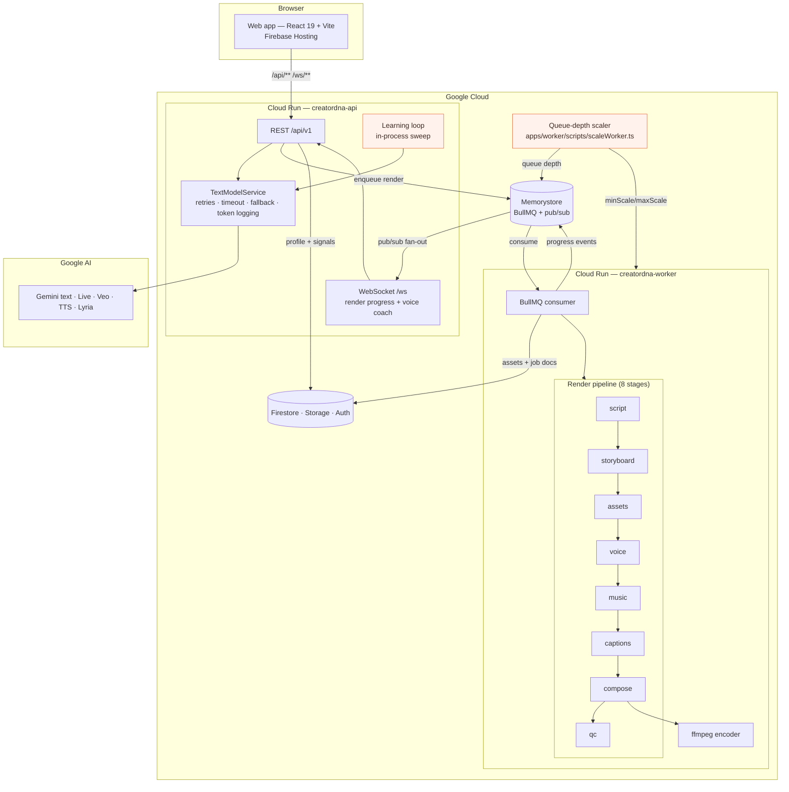

# CreatorDNA Studio

> AI studio that learns who a creator is (their **Creator DNA**) and turns any idea or trend into a finished 9:16 short video that sounds like them: script, hooks, audience feedback, live voice coaching, video, music, and captions, all in one pipeline.

🌐 **Live Demo:** [View it here](https://&lt;username&gt;.github.io/&lt;repo-name&gt;/)

[](https://github.com/&lt;username&gt;/&lt;repo-name&gt;/actions/workflows/ci.yml)
[](https://github.com/&lt;username&gt;/&lt;repo-name&gt;/actions/workflows/deploy.yml)
[](LICENSE)
[](https://nodejs.org)
[](https://pnpm.io)


---

## 🎯 Problem

Every AI video tool makes you start from a blank page. You describe what you want
in *its* vocabulary, it produces something generic, and then you spend an hour
editing it back into something that sounds like you. The tool learns nothing.

The result is a specific, recognisable failure: **the output does not sound like
the person who asked for it.** A creator who writes short, blunt sentences gets
a script with hedge words in it. A creator whose whole thing is one running joke
gets a video that never makes the joke. The fix is not a better prompt — it is a
tool that *remembers*.

## 💡 Solution

CreatorDNA Studio keeps a persistent **Creator DNA** profile in Firestore — your
niche, tone, audience, style, personality, vocabulary, catchphrases, dos and
donts — and injects it into **every** prompt, as a compact context block that is
recomputed on read.

From there, one pipeline: an idea or a trend becomes a script in your voice, a
set of hooks in distinct styles, an audience-mirror prediction per segment, a
live coaching session, and a finished 9:16 MP4 with a voice-over, a music bed and
timed captions.

And a **learning loop** that watches what you actually *do* — which hook you
chose, which remix you approved or rejected, which audience tip you applied — and
proposes profile updates from that evidence. It never applies them. You accept or
reject each one, and every accepted change is snapshotted so the version history
can show what was actually given up.

## ✨ Features

| Feature | What it does | Status |
| --- | --- | :--: |
| **Creator DNA Profile** | Five-step onboarding → a persistent profile with an animated sync/completeness ring; injected into every prompt as a < 500-token context block | ✅ |
| **Edit DNA** | Edit any field; `dnaVersion` bumps only when the content actually changed | ✅ |
| **Trend Remix** | A seeded 20-format catalogue ranked against your DNA; remix keeps the trend's structure and swaps topic, examples and CTA with an audit trail | ✅ |
| **Hook Lab** | 5–8 hooks in distinct styles (question, bold claim, POV, story, contrarian, curiosity gap), each with why it works; regenerate one style at a time | ✅ |
| **Audience Mirror** | Per-segment reaction prediction with a tip per segment; apply a tip straight into the copy | ✅ |
| **Live Voice Coach** | A Gemini Live session over WebSocket: speak your script, get tips in real time, with a daily cap | ✅ |
| **One-Click Video Pipeline** | idea → script → storyboard → clips/voice/music/captions → compose → QC → MP4, with live progress | ✅ |
| **Learning Loop** | Signals from real choices → LLM proposals → **accept or reject**, never auto-applied | ✅ |
| **DNA Version History** | Every accepted change snapshotted, newest first, score recomputed from the snapshot | ✅ |
| **Library** | Every finished render with its captions, caption/hashtags and copy buttons | ✅ |
| **Demo Mode** | A read-through cache over every render stage: instant, offline, zero-quota demos | ✅ |
| **Publish** | Copy-ready caption + hashtags; no third-party API is called yet | ⚠️ |

## 🏗️ Architecture



The three lines that shape everything else:

- **The API owns the AI wrapper, the worker owns the encoder.** The API never renders and the worker never calls a text model. That is what lets the API stay small and scale on latency while the worker is large and scales on backlog.
- **One origin in the browser.** Hosting rewrites `/api/**` to Cloud Run, so there is no CORS in production and the WebSocket is same-origin.
- **Progress is fan-out, not broadcast.** The worker publishes to Redis pub/sub and *every* API replica re-broadcasts to the sockets it holds. That is why multiple API instances work without session affinity — affinity is for latency, not correctness.

## 📁 Structure

<details>
<summary><b>Expand the full tree</b></summary>

```
creatordna/
├── apps/
│   ├── web/                    # React 19 + Vite + Tailwind v4 frontend
│   │   ├── src/pages/          # One component per route (14 screens)
│   │   ├── src/components/     # Shared UI + dna/, render/, voiceCoach/ groups
│   │   ├── src/hooks/          # TanStack Query wrappers per domain
│   │   ├── src/lib/            # API client, signal emitter, per-domain clients
│   │   ├── src/store/          # Zustand: auth session, UI draft, toasts
│   │   ├── src/theme/          # Design tokens (peach/coral), mirrored in index.css
│   │   └── src/test/           # RTL setup, fixtures, auth helpers
│   ├── api/                    # Express REST + ws + BullMQ producers
│   │   ├── src/routes/         # URL → controller mapping, one router per domain
│   │   ├── src/controllers/    # Thin translation layer: request → service
│   │   ├── src/services/       # Business logic + services/ai/ (the one AI wrapper)
│   │   ├── src/lib/            # Repositories, redis, firebase-admin, logger, errors
│   │   ├── src/middleware/     # auth (Firebase token), validate (zod), rateLimit
│   │   ├── src/voiceCoach/     # Gemini Live session handler + registry
│   │   ├── src/ws/             # The /ws server and its upgrade router
│   │   ├── src/config/         # zod-validated env, parsed once at boot
│   │   └── scripts/            # smoke.ts (40 checks), seedTrends.ts, seedDemo.ts
│   └── worker/                 # BullMQ consumers + the render pipeline
│       ├── src/jobs/           # One job handler per queue task
│       ├── src/workers/        # The BullMQ Worker instances
│       ├── src/lib/            # renderDeps (wiring), queueScaling (the policy)
│       ├── src/queues/         # Queue definitions
│       └── scripts/            # scaleWorker.ts (queue-depth autoscaler)
├── packages/
│   ├── shared/                 # Types, zod schemas, constants, logger
│   │   ├── src/schemas/        # 10 schema modules — the only place a shape lives
│   │   ├── src/constants/      # QUEUE_NAMES, RENDER_STAGE_PLAN, COST_LIMITS, WS_EVENTS
│   │   ├── src/lib/            # dnaCompleteness, dnaSyncScore, dnaContext, renderProgress
│   │   └── src/types/          # Inferred from the schemas
│   ├── prompts/                # Versioned prompt registry
│   │   └── src/templates/      # 8 templates, each a .v1.ts file
│   └── render/                 # The render pipeline, shared by API and worker
│       ├── src/media/          # WAV / PNG / WebVTT / MP4 readers and writers
│       ├── src/mediaModels.ts  # Veo, TTS, Lyria, Gemini-transcribe REST clients
│       ├── src/ai.ts           # The RenderAi seam: mock | live | demo
│       ├── src/stages.ts       # The eight stage runners
│       ├── src/composers.ts    # ffmpeg | mock composers
│       └── src/qc.ts           # Post-render checks
├── infra/
│   ├── cloudrun/               # 4 service specs (api/worker × staging/production)
│   ├── firebase/               # Rules, indexes, Hosting config, .firebaserc
│   └── docker-compose.yml      # Local Redis + optional queue inspector
├── docs/                       # Architecture, schema, API, WS, setup, deployment, FAQ
├── .github/
│   ├── workflows/              # ci.yml (verify), cd.yml (Cloud Run), deploy.yml (Pages)
│   ├── ISSUE_TEMPLATE/         # Bug report + feature request
│   └── PULL_REQUEST_TEMPLATE.md
├── verify-all.sh               # tsc + eslint + vitest per package, exit codes captured
└── pnpm-workspace.yaml
```

</details>

## 🚀 Getting Started

> 🌐 **Live Demo:** [View it here](https://&lt;username&gt;.github.io/&lt;repo-name&gt;/)
>
> Don't want to run it locally? The hosted build is the fastest way to look around.
> Note that the deployed app has no AI keys, so renders use the demo cache.

### Prerequisites

- Node **>= 20.11** (see `.nvmrc`)
- pnpm **>= 10** (`corepack enable`)
- Docker, for Redis (`infra/docker-compose.yml`)

### 1. Clone

```bash
git clone https://github.com/<username>/<repo-name>.git
cd <repo-name>
```

### 2. Install

```bash
corepack pnpm install
```

### 3. Configure the environment

```bash
cp apps/api/.env.example   apps/api/.env
cp apps/worker/.env.example apps/worker/.env
cp apps/web/.env.example   apps/web/.env
```

The defaults run the whole stack with **no Firebase project and no AI key**:
`DEV_AUTH_BYPASS=true` authenticates via an `x-dev-uid` header, and every AI slot
falls back to a mock that says so in the boot log.

> 🔑 **Never commit `.env`.** It is git-ignored; only `.env.example` is tracked.
> The API and worker validate their environment with zod at boot and refuse to
> start with a formatted list of what is wrong.

### 4. Start Redis

```bash
docker compose -f infra/docker-compose.yml up -d
```

### 5. Run everything

```bash
corepack pnpm dev
```

| App    | URL                   | Notes                                            |
| ------ | --------------------- | ------------------------------------------------ |
| web    | http://localhost:5173 | Vite dev server, proxies `/api`, `/health`, `/ws` |
| api    | http://localhost:4000 | `GET /health`, REST under `/api/v1`, WS at `/ws`  |
| worker | –                     | BullMQ worker, logs to stdout                    |

### 6. Seed the demo (optional but recommended)

```bash
corepack pnpm --filter @creatordna/api seed:demo
echo "DEMO_MODE=true" >> apps/worker/.env
```

This writes a demo creator with a complete DNA profile, warms the render cache,
and renders the golden video — so a demo render is instant and costs nothing.

### Verify it worked

```bash
bash verify-all.sh                                  # tsc + eslint + vitest, all six packages
corepack pnpm --filter @creatordna/api smoke        # 40 end-to-end checks over real HTTP
```

## 🔑 Env Vars

Full annotated list in [`docs/setup-local-dev.md`](docs/setup-local-dev.md) and
[`docs/ENVIRONMENT.md`](docs/ENVIRONMENT.md). The ones you will touch first:

| Variable | App | Default | What it does |
| --- | :--: | --- | --- |
| `NODE_ENV` | api, worker | `development` | `production` refuses `DEV_AUTH_BYPASS`, `AI_STUB_CLIENT` and `DEMO_MODE` at boot |
| `PORT` / `HOST` | api | `4000` / `0.0.0.0` | Where the REST + WS server listens |
| `DEV_AUTH_BYPASS` | api | `true` in dev | Trusts `x-dev-uid` instead of a Firebase ID token. **Refused in production** |
| `AI_STUB_CLIENT` | api | `false` | Uses a fake Gemini client so the DNA flow demos with no key |
| `REDIS_URL` | api, worker | `redis://127.0.0.1:6379` | BullMQ queues **and** the render progress pub/sub |
| `REDIS_ENABLED` | api, worker | `true` | `false` disables live render progress — renders still finish, they just poll |
| `QUEUE_PREFIX` | api, worker | `creatordna` | Keeps BullMQ keys separate in a shared Redis |
| `CORS_ORIGINS` | api | localhost dev origins | Only needed when web and API are on different origins |
| `FIREBASE_PROJECT_ID` etc. | api, worker | – | Required in production; dev falls back to local files |
| `GEMINI_API_KEY` | worker | – | Veo clips + TTS voice. Absent → those slots use mocks, logged |
| `GEMINI_TEXT_MODEL` | api | – | The text/JSON model. **Never hard-coded** — read from env |
| `GEMINI_LIVE_MODEL` | api | – | The Live API model for voice coaching |
| `VEO_MODEL` / `LYRIA_MODEL` / `TTS_MODEL` / `TRANSCRIBE_MODEL` | worker | – | The media slots, each degrading independently |
| `AI_FALLBACK_MODEL` | api, worker | – | Used when the primary text model is unavailable |
| `RENDER_COMPOSER` | worker | `auto` | `auto` \| `ffmpeg` \| `mock`. Production sets `ffmpeg` |
| `WORKER_CONCURRENCY` | worker | `4` | Renders per instance; also what the autoscaler divides by |
| `DEMO_MODE` / `DEMO_CACHE_DIR` | worker, api | `false` | Serves every render stage from the pre-baked cache |
| `VITE_API_URL` | web (build) | `''` | **Empty is correct** — Hosting rewrites `/api` same-origin |

## 📜 Scripts

| Command | What it does |
| --- | --- |
| `pnpm dev` | Runs `dev` in every workspace, in parallel |
| `pnpm build` | Topological build (`shared`/`prompts` first, then apps) |
| `pnpm lint` | ESLint across the repo (type-aware for api/worker) |
| `pnpm typecheck` | `tsc --noEmit` in every workspace |
| `pnpm test` | Vitest in every workspace |
| `pnpm clean` | Removes `dist` everywhere |
| `pnpm --filter @creatordna/api smoke` | 40 end-to-end checks over real HTTP |
| `pnpm --filter @creatordna/api seed:trends` | Seeds the 20-format trend catalogue (idempotent) |
| `pnpm --filter @creatordna/api seed:demo` | Writes the demo creator, warms the cache, renders the golden video |
| `pnpm --filter @creatordna/worker scale:worker` | Sizes the worker fleet from the `render` queue depth (`SCALE_DRY_RUN=true` to preview) |

## 🗺️ How It Works

What a creator does, and where in the code it lands:

| You… | Code that runs |
| --- | --- |
| Sign in | `apps/web/src/pages/LoginPage.tsx` → `POST /api/v1/me` → `apps/api/src/middleware/auth.ts` verifies the Firebase ID token |
| Complete onboarding | `apps/web/src/pages/OnboardingPage.tsx` → `POST /api/v1/dna/extract` → `apps/api/src/services/dna.service.ts` + the `dna-extract` prompt |
| See your score ring | `apps/web/src/components/dna/` reads `computeDnaSyncScore` / `computeDnaCompleteness` from `packages/shared/src/lib/` |
| Pick a trend and remix it | `apps/web/src/pages/TrendRemixPage.tsx` → `POST /api/v1/trends/for-me`, `/remix` → `apps/api/src/services/trend.service.ts` |
| Write and choose a hook | `apps/web/src/pages/HookLabPage.tsx` → `POST /api/v1/trends/hooks` → the `hook-lab` prompt |
| Run the Audience Mirror | `apps/web/src/pages/AudiencePage.tsx` → `POST /api/v1/audience-mirror`, `/improve` → `apps/api/src/services/audience.service.ts` |
| Approve a script | `POST /api/v1/projects/:id/approve` → snapshots the DNA onto the job, so a retry is reproducible |
| Render | `POST /api/v1/render` → BullMQ → `apps/worker/src/jobs/render.job.ts` → `packages/render/src/pipeline.ts` |
| Watch progress | `apps/web/src/pages/RenderProgressPage.tsx` ⇄ `apps/api/src/ws/index.ts` over Redis pub/sub |
| Get the video | `apps/web/src/pages/RenderResultPage.tsx` reads the `mp4` asset from `GET /api/v1/render/:id` |
| Coach your delivery | `apps/web/src/pages/VoiceCoachPage.tsx` ⇄ `apps/api/src/voiceCoach/wsHandler.ts` (Gemini Live) |
| Accept a DNA suggestion | `apps/web/src/components/dna/SuggestedUpdates.tsx` → `POST /api/v1/dna/suggestions/:id/accept` → `apps/api/src/services/dnaLearning.service.ts` |

## 📚 Documentation

| Doc | What is in it |
| --- | --- |
| [`docs/architecture.md`](docs/architecture.md) | The pipeline end to end, the API/worker split, and why progress is fan-out |
| [`docs/firestore-schema.md`](docs/firestore-schema.md) | Every collection and document path, with the rules that guard them |
| [`docs/api-reference.md`](docs/api-reference.md) | Every REST endpoint, with request and response shapes |
| [`docs/websocket-events.md`](docs/websocket-events.md) | `/ws` and `/ws/voice-coach`: message types, close codes, auth |
| [`docs/setup-local-dev.md`](docs/setup-local-dev.md) | Step-by-step local setup, including the no-keys path |
| [`docs/deployment.md`](docs/deployment.md) | GitHub Pages for the web app, Cloud Run for the services |
| [`docs/faq.md`](docs/faq.md) | The questions that come up, answered |
| [`docs/ENVIRONMENT.md`](docs/ENVIRONMENT.md) | Every env var across all three processes |

## 🎬 Demo

<!-- TODO: replace with a real recording before the first public release.
     A 60-second screen capture of idea → script → mirror → approve → render
     is worth more than any paragraph above. Keep it under 5 MB so it renders
     inline on a slow connection. -->


**Or try it live:** 🌐 **[View it here](https://&lt;username&gt;.github.io/&lt;repo-name&gt;/)**

To reproduce the demo locally:

```bash
corepack pnpm --filter @creatordna/api seed:demo   # demo creator + golden video
corepack pnpm dev
```

Then sign in as `demo-creator`, walk Trends → Remix → Mirror → Create, and accept
a suggested DNA update on My DNA to watch the version history move.

## 🧪 Testing

```bash
corepack pnpm test        # 1035 tests across 6 workspaces
```

| Workspace | Tests | Focus |
| --- | --- | --- |
| `packages/shared` | 206 | zod schemas, constants, DNA completeness, sync score, context builder, render progress |
| `packages/prompts` | 66 | registry, strict interpolation, versioning, 8 templates |
| `packages/render` | 137 | media writers, asset store, job repository, the 8 stages, resume, QC, AI seam, media clients, demo cache |
| `apps/api` | 275 | env, auth, validation, health, CORS, WS handshake, AI wrapper, DNA, trends, hooks, mirror, render jobs, learning loop, autoscaling policy |
| `apps/worker` | 49 | env, processors, worker wiring, queue-depth autoscaling policy |
| `apps/web` | 302 | tokens, api client, auth store, routing, all 14 screens, signal emission |

Unit tests only (no Redis, no network) — they run in CI. The DNA and trend flows
are additionally verified end to end by `pnpm --filter @creatordna/api smoke`.

## 🗺️ Roadmap

**Shipped**

- [x] Creator DNA profile with completeness + sync scoring
- [x] `buildDnaContext` — the < 500-token block injected into every prompt
- [x] Trend catalogue, ranking, remix and Hook Lab
- [x] Audience Mirror with per-segment tips
- [x] Live Voice Coach over WebSocket
- [x] Eight-stage render pipeline with per-stage retry
- [x] Real media adapters: Veo, Gemini TTS, Lyria, Gemini caption alignment
- [x] Learning loop with accept/reject and version history
- [x] Dockerfiles, Cloud Run specs, Firebase Hosting, GitHub Actions CD
- [x] Queue-depth autoscaling for the worker
- [x] Demo mode with a seeded golden video

**Next**

- [ ] Wire Remotion as the production composer (chromium is already in the worker image)
- [ ] A cancel endpoint — cancel is currently client-side only
- [ ] Publish to a real destination (YouTube Shorts / TikTok) instead of copy-ready text
- [ ] Cloud Scheduler job that invokes the queue-depth scaler
- [ ] Alerting policies: queue depth above ceiling, `DEMO_MODE` in production, `/health` degradation
- [ ] Terraform for the project, Memorystore, Artifact Registry and IAM
- [ ] Close the Phase 8 gap: `startRender()` has no caller and `CreatePage.tsx` is a placeholder

**Later**

- [ ] Multi-creator workspaces / teams
- [ ] A/B test two DNA versions against real retention
- [ ] Import an existing back catalogue and extract a DNA from it
- [ ] Localise the voice-over beyond English

## 🤝 Contributing

Contributions are welcome. Please read [`CONTRIBUTING.md`](CONTRIBUTING.md) first —
it covers the branch/commit conventions, how to run the checks, and the rules the
codebase holds itself to (no hard-coded model ids, every AI call through one
wrapper, structured JSON validated with zod).

Short version:

```bash
corepack pnpm install
corepack pnpm lint && corepack pnpm typecheck && corepack pnpm test
```

Bug reports and feature requests go through the issue templates in
[`.github/ISSUE_TEMPLATE/`](.github/ISSUE_TEMPLATE/).

## 📄 License

[MIT](LICENSE) © CreatorDNA Studio contributors

See [`CHANGELOG.md`](CHANGELOG.md) for what changed and when, and
[`CODE_OF_CONDUCT.md`](CODE_OF_CONDUCT.md) for the expectations we hold each other to.

---

## ⚠️ Where to put your own URLs

Four placeholders need replacing before this README is publishable:

1. **The live demo link** (line 5, and again at lines 197 and 354) — replace
   `https://<username>.github.io/<repo-name>/` with your real GitHub Pages URL.
2. **The CI and CD badge links** (lines 7–8) — replace `<username>` and
   `<repo-name>`, or delete the two badges.
3. **The clone command** in Getting Started (line 211) — 
   `git clone https://github.com/<username>/<repo-name>.git`.

The one that matters most is **line 5**: it is the "🌐 **Live Demo:**" line directly
under the tagline, and it is the URL the Demo section and Getting Started point at.

If you are publishing to GitHub Pages for the first time, remember that the
[deploy workflow](.github/workflows/deploy.yml) cannot enable Pages for you — set
**Settings → Pages → Source → GitHub Actions** once, by hand. See
[`docs/deployment.md`](docs/deployment.md).
